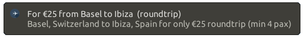

<h1> Travel deal push notification

General:
-------
This script wrapps the content of http://www.secretflying.com/ and sends desktop push notifications on gnome-desktop if a new deal comes out.

Configure:
---------
To set your region edit the url in the get_article() function

Run:
---
To run type:
```
cd src
./push.sh
```

Dependencies:
------------
BeautifulSoup
- Ubuntu: <code class="shell">pip install beautifulsoup4</code>

GeoText:
- Ubuntu: <code class="shell">pip install GeoText</code>

pyaudio
- Ubuntu: <code class="shell">sudo apt-get install python-pyaudio</code>


Screenshots:
-----------


Sound by [akx](https://github.com/akx/Notifications)<br>
Icon made by Maxim Basinski from www.flaticon.com
